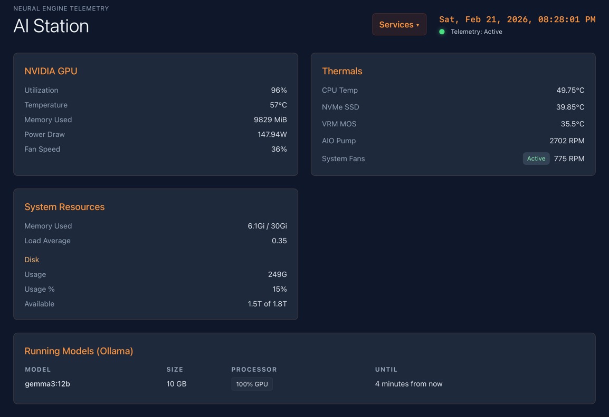

# bun-monitor

AIStation Monitor — Bun-based system telemetry and model dashboard

## Features

- Real-time NVIDIA GPU stats (fan, temp, power, memory, utilization)
- System thermals (CPU, SSD, VRM, pump, fans) via `sensors`
- Disk usage and load average
- Ollama model status (via Docker)
- Modern web UI (Tailwind CSS)
- Fast Bun TypeScript backend
- Docker-ready for easy deployment



## Quick Start

Install dependencies:

```bash
bun install
```

Run the server:

```bash
bun index.ts
```

Open [http://localhost:4000](http://localhost:4000) in your browser.

## Docker Usage

Build and run with Docker Compose:

```bash
docker compose up -d --build
```

View logs:

```bash
docker compose logs -f
```

Run sensors inside the container:

```bash
docker exec -it bun-monitor bash
sensors
```

## Development

- Source code is mounted into the container for live development
- Edit TypeScript and HTML/CSS, refresh browser to see changes
- Console logs are visible via Docker logs

## API

- `/api/stats` — Combined telemetry (GPU, system, disk, models)
- `/api/fresh_stats` — Uncached fresh telemetry

## Requirements

- Bun runtime (see [Bun](https://bun.com))
- Docker (for containerized deployment)
- NVIDIA drivers and Docker GPU toolkit (for GPU stats)
- lm-sensors (for system thermals)

## License

MIT License
